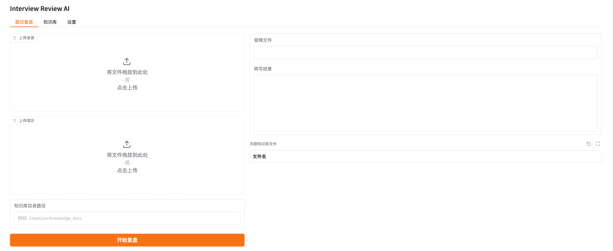
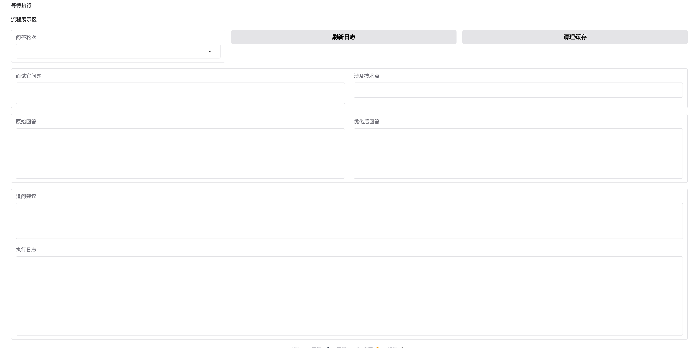

# PostInterviewAI

面试复盘系统（Interview Review AI）。

项目目标：在面试结束后，基于录音与知识库内容，使用大模型完成问答分析与优化，帮助求职者生成更专业的复盘结果与后续改进建议。

项目中所有使用到的模型均来自于阿里百炼平台。（该平台的所有模型均有1M的免费使用额度）

---

## 1. 界面预览

### 1.1 文件与知识库上传（面试复盘页）



**面试复盘** 为默认主界面：顶部可在「面试复盘 / 知识库 / 设置」之间切换。左侧为输入区——**上传录音**、**上传简历** 支持拖拽或点击选择文件；**知识库目录路径** 填写本机知识库文件夹路径（如 `/Users/xxx/knowledge_docs`）；点击 **开始复盘** 启动流水线。右侧为结果区——展示当前 **音频文件** 名、**转写结果** 文本，以及 **关联知识库文件** 列表（表头为「文件名」，可复制或展开查看）。

### 1.2 问答展示（流程展示区）



**流程展示区** 用于查看模型对单轮问答的分析结果。顶部状态为流程执行情况；**问答轮次** 下拉可切换不同对话轮次；**刷新日志**、**清理缓存** 用于刷新执行日志与清理缓存。主体区域依次展示：**面试官问题**、**涉及技术点**、**原始回答**（转写得到的原始表述）、**优化后回答**（模型优化后的建议表述）、**追问建议**；最下方为 **执行日志**，便于对照排查各阶段运行情况。

---

## 2. 核心能力

本项目整合了三个已开发子模块能力：

- 录音转写优化（ASR + 角色识别）
- 知识库工程（简历抽取 + 参考文档归类总结）
- 问答抽取与回答优化（技术点识别、答案优化、追问建议）

并提供了可视化界面（Gradio）：

- 面试复盘页
- 知识库页
- 设置页（模型与参数配置）

---

## 3. 功能特性

- **统一 Prompt 管理**：所有业务 Prompt 集中在 `config/prompts.json`
- **参数集中配置**：模型与流程参数统一在 `config/settings.json`
- **中间数据全量落盘**：每次运行按 `run_id` 保存完整阶段产物
- **日志监控**：应用日志 + 错误日志 + 每次运行 trace
- **缓存复用**：
  - 全流程缓存（完整成功后命中）
  - 阶段级缓存（ASR / KB / QA 各阶段独立命中）
  - 重启后仍可复用历史缓存，减少重复调用模型

---

## 4. 项目结构

```text
PostInterviewAI/
├── app.py
├── requirements.txt
├── README.md
├── images/
│   ├── 1.png
│   └── 2.png
├── config/
│   ├── settings.json
│   └── prompts.json
├── modules/
│   ├── asr_module.py
│   ├── kb_module.py
│   └── qa_module.py
├── pipeline/
│   ├── config_loader.py
│   └── orchestrator.py
├── storage/
│   └── data_store.py
├── logs/
└── data/
    ├── runs/
    └── cache/
```

---

## 5. 环境准备

建议 Python 3.10+（当前代码可在更高版本运行）。

### 5.1 创建虚拟环境

```bash
cd /Users/xiaobenla/PythonProjects/PostInterviewAI
python3 -m venv .venv
```

### 5.2 安装依赖

```bash
.venv/bin/python -m pip install -r requirements.txt
```

### 5.3 系统依赖

ASR 音频转码依赖 `ffmpeg`，请确保已安装并可在终端执行 `ffmpeg -version`。

---

## 6. 配置说明

### 6.1 `config/settings.json`

关键配置项：

- `api.dashscope_api_key`：必填，DashScope Key
- `api.dashscope_base_url`：默认 `https://dashscope.aliyuncs.com/compatible-mode/v1`
- `models.asr_model`：ASR 模型
- `models.llm_model`：文本模型（角色识别、QA 抽取、优化、追问）
- `models.kb_model`：知识库抽取模型
- `models.max_tokens`：生成上限
- `pipeline.asr_segment_seconds`：ASR 分段长度
- `pipeline.asr_min_segment_seconds`：最小分段阈值
- `pipeline.history_rounds`：历史轮次窗口

### 6.2 `config/prompts.json`

所有 Prompt 统一维护在此，已按原始模块风格整合，支持占位符：

- `{var}`
- `{{var}}`
- `#var#`

---

## 7. 启动方式

```bash
cd /Users/xiaobenla/PythonProjects/PostInterviewAI
.venv/bin/python app.py
```

启动后访问本地地址（默认）：`http://127.0.0.1:7860`

---

## 8. 使用流程

1. 打开“设置”页，填写 `DashScope API Key` 并保存
2. 回到“面试复盘”页，上传录音、上传简历、填写知识库目录
3. 点击“开始复盘”
4. 查看：
   - 转写结果
   - 问答轮次对比（原回答 / 优化回答）
   - 技术点
   - 追问建议
   - 执行日志

---

## 9. 输出与缓存

### 9.1 每次运行输出

目录：`data/runs/<run_id>/`

典型文件：

- `input_manifest.json`
- `trace.jsonl`
- `asr_transcript_raw.txt`
- `asr_transcript.txt`
- `resume_info.json`
- `reference_docs.json`
- `qa_extraction.json`
- `qa_optimization.json`
- `ui_view_model.json`

### 9.2 缓存索引

- 全流程缓存：`data/cache/audio_cache_index.json`
- 阶段缓存：`data/cache/stage_cache_index.json`

说明：阶段缓存可在后续阶段失败时继续复用已完成阶段结果，避免每次从第一步重跑。

---

## 10. 日志说明

- 应用日志：`logs/app.log`
- 错误日志：`logs/error.log`
- 单次执行链路：`data/runs/<run_id>/trace.jsonl`

可用于快速定位失败阶段与参数上下文。

---

## 11. 常见问题

### Q1: 报错 `请先在设置中填写 dashscope_api_key`

请在“设置”页填写并保存 API Key。

### Q2: 报错与 `ffmpeg` 相关

说明本地缺少 `ffmpeg` 或不可用，请先安装后重试。

### Q3: 缓存似乎没有命中

请检查是否变更了以下内容（会导致缓存键变化）：

- 模型参数
- 流程参数
- Prompt 内容
- 输入文件内容（录音/简历/知识库目录）

### Q4: Prompt 改了不生效

在“设置”页点击“重新加载 Prompt”，或重启应用。

---

## 12. 说明

本项目用于面试复盘与训练场景，优化回答应保持事实一致，避免虚构履历与项目经验。
